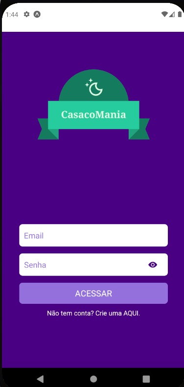
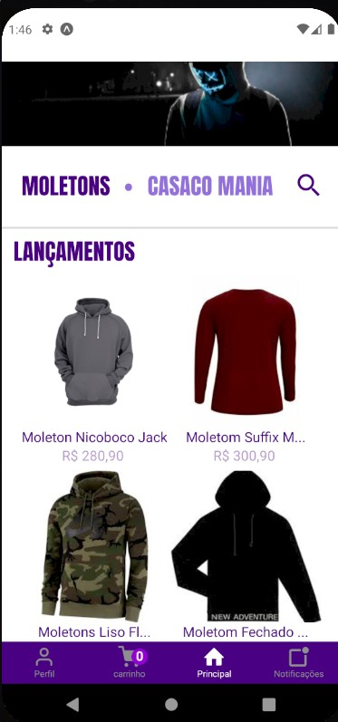
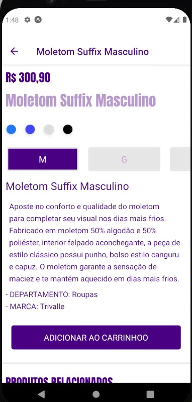

<h1 align="center">
    
</h1>

<h4 align="center"> 
	🚧 "Casaco Mania App" 🚀 em construção... 🚧
</h4>

<p align="center">
  

  

  <a href="https://github.com/ThiagoZellMendes/AppReactNative/commits/AppFacul">
    
  </a>

  
   <a href="https://github.com/ThiagoZellMendes/AppReactNative/stargazers">
    
  </a>
</p>


## 💻 Sobre o projeto

:tshirt: CasacoMania é um Ecomemerce desenvolvido em ReactNative, para meios de aprendizado das tecnologias nele usadas.

Nele o usuario podera cadastrar seu acesso, e comprar casacos, o app vai do cadastro do cliente a venda dos produtos:

- Cadastro do Cliente com autenticação atrave do Firebase;
- escolha do casaco e adição dos mesmos no Carrinho de comprar;
- possibilidade de retirada dos itens do carrinho;
- escolha da forma de pagamento e geração do boleto ou confimação de compra(em construção)

Projeto desenvolvido para prova final da faculdade, mas que foi bem além disso :smile:


## 🎨 Layout

<p align="center">
  

  
	
  
  
  
</p>


## 🛠 Tecnologias

As seguintes ferramentas foram usadas na construção do projeto:

- [Expo][expo]
- [Node.js][nodejs]
- [React Native][rn]
- [JavaScript][javascript]


## 🚀 Como executar o projeto

O projeto foi criando em Expo ou seja precisaremos do mesmo instalado:


💡é Preciso um emulador para executar o app, no meu caso usei "AndroidStudio", mas pode ser usando outros:

### Pré-requisitos

Antes de começar, você vai precisar ter instalado em sua máquina as seguintes ferramentas:
[Git](https://git-scm.com), [Node.js][nodejs]. 
Além disto é bom ter um editor para trabalhar com o código como [VSCode][vscode]

### 🎲 Rodando o App:

```bash
# Clone este repositório
$ git clone https://github.com/ThiagoZellMendes/AppReactNative

# Acesse a pasta do projeto no terminal/cmd
$ cd AppReactNative

# Instale as dependências
$ npm install

# Execute a aplicação:
$ npm start

# Aplicativi foi otimizado para Android:
$ Escolha "a" para abrir ele para Android
``` 


## 😯 Como contribuir para o projeto

1. Faça um **fork** do projeto.
2. Crie uma nova branch com as suas alterações: `git checkout -b my-feature`
3. Salve as alterações e crie uma mensagem de commit contando o que você fez: `git commit -m "feature: My new feature"`
4. Envie as suas alterações: `git push origin my-feature`
> Caso tenha alguma dúvida confira este [guia de como contribuir no GitHub](https://github.com/firstcontributions/first-contributions)


## 📝 Licença

Este projeto esta sobe a licença MIT.

Feito com Muito Carinho por Thiago Mendes 👋🏽 [Entre em contato!](https://www.linkedin.com/in/thiago-mendes-44176249/)

[nodejs]: https://nodejs.org/
[expo]: https://expo.io/
[rn]: https://facebook.github.io/react-native/
[yarn]: https://yarnpkg.com/
[vscode]: https://code.visualstudio.com/
[JavaScript]:https://developer.mozilla.org/pt-BR/docs/Web/JavaScript
[license]: https://opensource.org/licenses/MIT
[vceslint]: https://marketplace.visualstudio.com/items?itemName=dbaeumer.vscode-eslint
[prettier]: https://marketplace.visualstudio.com/items?itemName=esbenp.prettier-vscode
